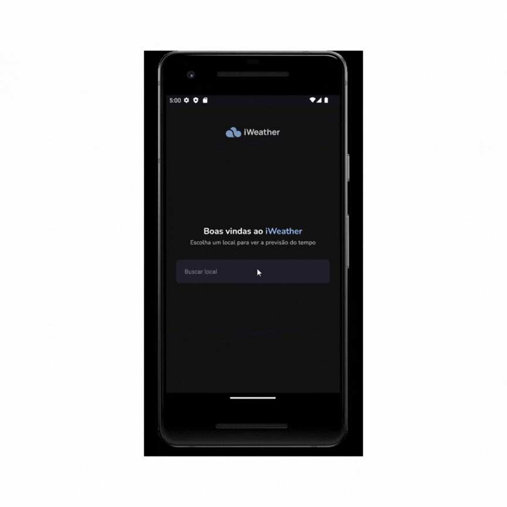

+## 💻 Projeto

# Unity-test-iweather
[](https://github.com/rodrigo-teixeira-silva/unity-test-iweather/blob/main/LICENSE)

# Sobre o projeto
## Aplicação de previsão do tempo

Criação de uma A aplicação Meteorologia disponibiliza informação atualizada sobre condiçõed como temperatura, chuva, neve e vento. Veja a previsão de hora em hora dos próximos dias. E criação de testes de unidade, componentes, mocks, hooks, routes,cobertura de codigo e teste de integração.

 **</>Codelink**.

## Layout mobile



## Resultado de cobertura dos testes


# Tecnologias utilizadas
## Aplicação

- [Expo](https://docs.expo.dev/?utm_source=google&utm_medium=cpc&utm_content=search&gclid=CjwKCAjwxOymBhAFEiwAnodBLE4O6-g49a-HniPnrQt_l-6t_CNvui4z2_h31jUCUpesirHbFYmI_hoC39IQAvD_BwE)
- [TypeScript](https://www.typescriptlang.org/docs/)
- [Google fonts](https://docs.expo.dev/develop/user-interface/fonts/#use-a-google-font)
- [react-native-dotenv](https://www.npmjs.com/package/react-native-dotenv)
- [NPM](https://docs.npmjs.com)
- [Phosphoricons](https://phosphoricons.com/)
- [Svg](https://docs.expo.dev/versions/latest/sdk/svg/)
- [Expo Image](https://docs.expo.dev/versions/latest/sdk/image/)
- [BlurHash](https://blurha.sh/)
- [React Navigation](https://reactnavigation.org/)
- [react-native-get-random-values](react-native-get-random-values)
- [Day.js](https://day.js.org/)
- [react-native-keyboard-aware-scroll-view](https://www.npmjs.com/package/react-native-keyboard-aware-scroll-view)
- [NetInfo](https://docs.expo.dev/versions/latest/sdk/netinfo/?tm_source=google&utm_medium=cpc&utm_content=performancemax&gclid=CjwKCAjwr_CnBhA0EiwAci5siu9brkVaSLxWFq5rnDPmU35J5cu2PyAD4gqF6pcpPFaIYK_mXWL_1RoCi6QQAvD_BwE)
- [AsyncStorage](https://docs.expo.dev/versions/latest/sdk/async-storage/)

## Test

- [jest](https://jestjs.io/pt-BR/)
- [react-native-safe-area-context](https://github.com/th3rdwave/react-native-safe-area-context)

# Funcionalidades testadas


- [x] Day
- [x] Input
- [x] Loading
- [x] NextDays
- [x] SelectList
- [x] WeatherDetails
- [x] WeatherToday
- [x] contexts
- [x] hooks
- [x] asyncStorage
- [x] routes
- [x] Dashboards
- [x] Search
- [x] services
- [x] styles
- [x] utils 

# Como executar o projeto

```bash
# clonar repositório
git clone https://github.com/rodrigo-teixeira-silva/unity-test-iweather.git

# entrar na pasta do projeto.
cd iweather

# instalar o pacote node_modules.
npm install

# executar o projeto.
npx expo start
``` 

# Como executar os testes
```bash

# executar todos os testes.
npm test 

# gerar o relatorio de teste 
npm run test:coverenge 
```
## Aplicação Mobile

Pré-requisitos: 
- npm
- node
- expo 

# Autor

Rodrigo Teixeira Silva


## [Linkedin](https://www.linkedin.com/in/rodrigo-teixeira-silva/)

